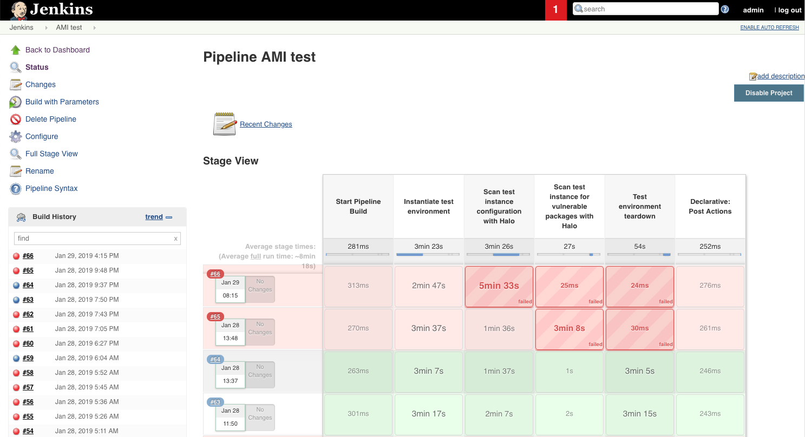
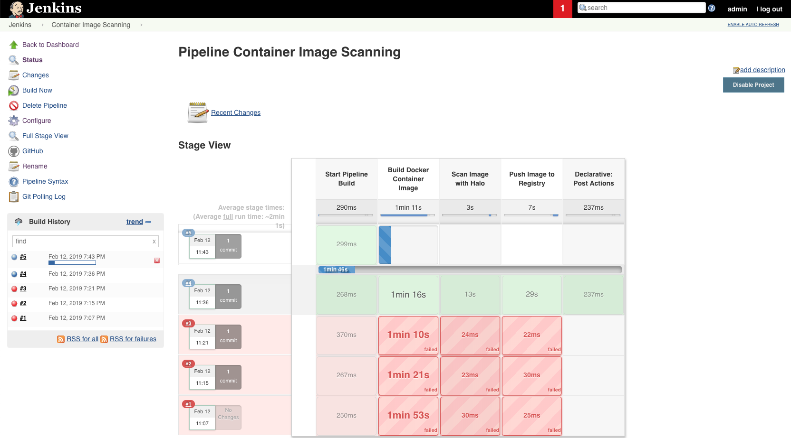

# Sample scripts for CI pipeline scanning of assets with Halo

This repository contains two sample scripts which show how to scan virtual
machine-based workloads (instances) and container images with Jenkins.
Halo scan results are sent to Slack. These scripts are written for Jenkins
pipeline tasks.

---

## Scanning AMIs

For scanning AMIs in the CI pipeline, refer to the
[scan_instance.md](./scan_instance.md) file. This file describes a process which
instantiates and scans an AWS instance with CloudPassage Halo, and will pass or
fail the build based on whether the number of detected security defects are
above your configured threshold.

---

## Scanning Docker images

For scanning container images in the CI process, refer to the
[scan_container_image.md](./scan_container_image.md) file. This file describes
the process for building and scanning a container image with CloudPassage Halo,
and will pass or fail the build based on whether the number of detected
security defects exceeds the thresholds you've set.

While these scripts are not alone a production-ready drop-in solution, they do
show a clean process which can be worked into an existing CI pipeline. If you
would like assistance in instrumenting similar processes within your pipeline,
reach out to your CloudPassage salesperson or customer success contact.

<!---
#CPTAGS:community-supported integration deployment
#TBICON:images/python_icon.png
-->
