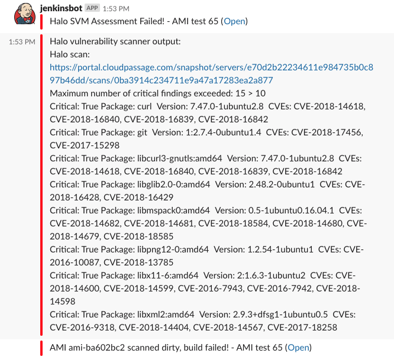

# Scan an AMI with CloudPassage Halo

## What this does

This pipeline script uses CloudFormation to create a VPC and associated assets
(security groups, etc) and places one EC2 instance within that VPC, which will
be based on the AMI ID you configured in the job parameters. Once the instance
is online, the Halo agent is installed and scanning begins. The Halo agent will
scan for configuration issues as well as vulnerable packages, and the build
will pass or fail based on whether or not the number of detected security
defects exceeds your threshold, as configured in the build parameters.

This is provided as example code, which would likely require some adjustment
before implementing in any end-to-end CI process.

## Requirements

* CloudPassage portal access
* Jenkins access
* Slack plugin configured in Jenkins
* AWS API keys with privileges sufficient for creating VPCs (and associated
  assets, like security groups), auto-scaling groups, and EC2 instances.

## Setup

* AWS
  * Create API keys with privileges sufficient for using CloudFormation to
  create VPCs (and associated assets) as well as auto-scaling groups and
  EC2 instances. Store the key and secret in Jenkins as Username with
  password-type credentials.
* CloudPassage:
  * Log into the CloudPassage portal and create a server group named `Scanner`.
  * Configure the `Scanner` group with the latest Ubuntu 16.04 CIS policy.
  * Create a read-only (auditor) API key within the `Scanner` group, and
   save the key ID and secret in Jenkins as a Username with password-type
   credential.
  * Save the Halo agent key for the `Scanner` group in Jenkins as a Secret
  text-type credential.
* Jenkins:
  * Create a Jenkins pipeline task.
  * Select "This project is parameterized"
  * Configure the parameters and defaults as illustrated here:
  [Jenkins scan instance parameters](./images/scan_instance_2.png).
  * Copy the contents of [scan_instance.groovy](./scripts/scan_instance.groovy)
  and paste into the pipeline script text box near the bottom of the pipeline
  configuration page.
  * Change the credential IDs in the pipeline script to match the IDs for the
  credentials you created earlier in Jenkins. For instance, the
  `54458f1e-81a3-4382-9751-e851dadb10b1` in
  `HALO_CI_API_CREDS = credentials('54458f1e-81a3-4382-9751-e851dadb10b1')` will
  need to be changed to the ID of the credentials you configured for the Halo
  API keys.

## Use

Select "Build with Parameters". You can accept the defaults, or insert your own
configuration to scan other AMIs available to your Amazon AWS API keys.
Build results will appear in Slack, and a link to the scan results is clickable
if further information is required.

