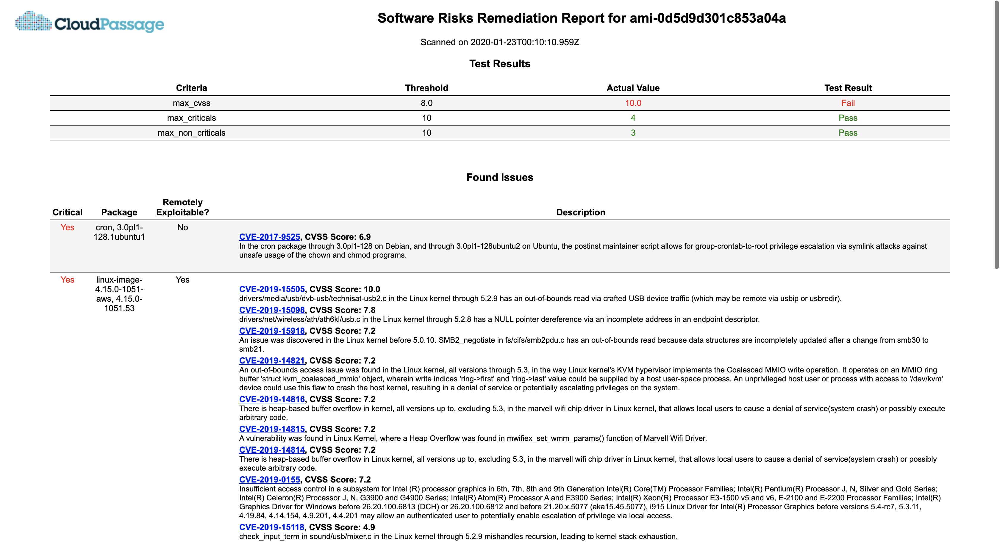
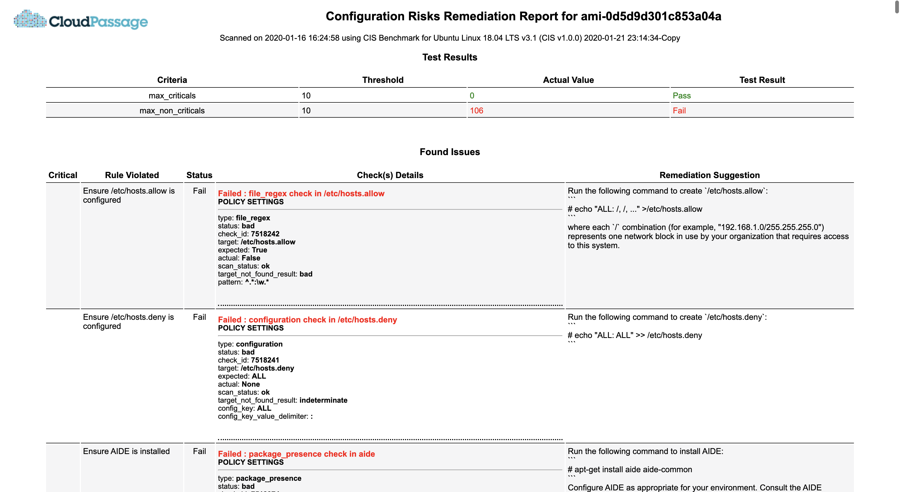

# Scan an AMI with CloudPassage Halo

## What this does

This pipeline script is an example of how to use CloudPassage Halo to scan AMIs
in your AMI build pipeline. Preceding steps of creating an AMI and launching a 
test instance with the Halo agent installed are outside the scope of CloudPassage
Halo and are therefore omitted here. Given a CSP instance ID as input, you can
create a build step that will download and run a Docker container image from a CloudPassage repository.
The containerized script will get the Software Vulnerability and/or Configuration
scan results via API and output reports in HTML format. These reports can be viewed
in Jenkins using third-party plug-ins such as the HTML Publisher plugin

This is provided as example code, which would likely require some adjustments
before injecting it into any end-to-end CI process.

## Requirements
* CloudPassage access with API key
* Jenkins with Docker installed on the hosts and added to PATH variable

## Setup and Usage

* CloudPassage:
  * Log into the CloudPassage portal and create a server group for AMI testing
  * Optionally add a configuration policy to the AMI testing group if intending to get
  configuration scan reports
  * Create a read-only (auditor) API key within the AMI testing group
  * Save the Halo agent installation script so that it can be used later in your Jenkins pipeline
* Jenkins:
  * Install Docker on Jenkins host. Add Docker in Jenkins global tool configuration. 
  Add Docker to PATH in Jenkins "Configure System"
  * Save CloudPassage API key and secret in Jenkins as username with password-type credential
  * Create Jenkins AMI build/bake pipeline
  * Setup the prerequisite steps of building an AMI and launching a test instance of the
  newly built AMI with the Halo Agent installed. Optionally, specify the server label in the 
  Halo agent installation script using the "--server-label=yourLabel" flag. This server
  label can then be used later on in the containerized script as an alternative method of
  finding the just-launched test instance in Halo.
  * Customize and then copy the relevant stages of [scan_instance.groovy](./scripts/scan_instance.groovy)
  as needed and paste it into your overall AMI pipeline script in the appropriate stages(create if necessary).
  Make sure that the Instance ID would be available in the stage that would run the Docker
  container script to retrieve scan results.
  * If using a freestyle project, you can copy and paste the shell commands instead
  * Through injecting environment variables to the Docker container, configure security test
  evaluation criteria such as MAX_CRITICAL, MAX_NON_CRITICAL, and MAX_CVSS. Make sure to
  specify the scan module (csm or sva). Instance ID, Halo API Secret and Key are required.
  * Check out [https://github.com/cloudpassage-community/server-ci-helper](https://github.com/cloudpassage-community/server-ci-helper)
  for more details on the above environment variables and settings
  * Be sure to mount a host directory onto the container by using the "-v flag" (see in [scan_instance.groovy](./scripts/scan_instance.groovy))
    that maps to the "/app/reports/html" directory within the container, which is where the
    security scan reports will be outputted in HTML files.
  * If a Jenkins host directory is mounted properly, the container script will output
  "halo_sva_results.html" and/or "halo_csm_results.html" to that host directory. Users
  can find these reports directly in the Jenkins workspace directory and then viewed using
  a web browser.
  * Optionally, a third-party plug-in can be used to publish the HTML scan reports and 
  made available as a link on the Jenkins build side-panel. In [scan_instance.groovy](./scripts/scan_instance.groovy),
  the HTML Publisher plugin is used. Specify the host directory containing the report in
  "reportDir" and the names of the HTML report files as named above. **CloudPassage does not
  own these third-party plugins and therefore, they are used as-is at the user's own risk.**
  * Run the build process to get and view the security scan reports that contain test
  results, vulnerabilities, findings, and remediation information.

